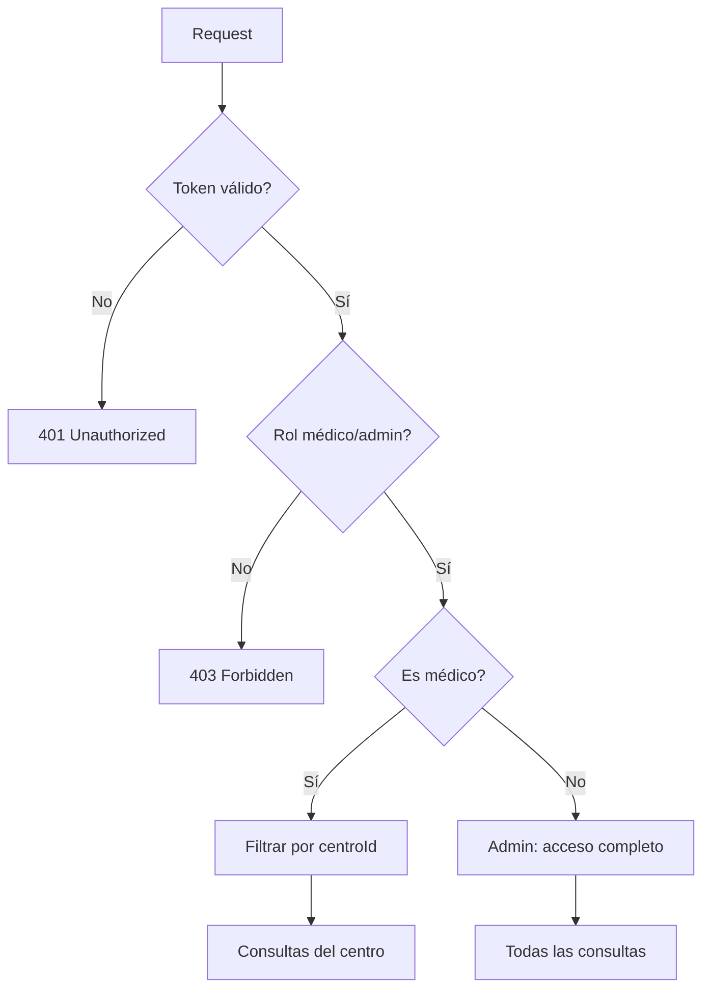

# Consultas API - Sistema Hospitalario

API especializada para la gestión de consultas médicas y generación de reportes del sistema hospitalario.

## 🏗️ Arquitectura

```
consultas-api/
├── src/
│   ├── controllers/              # Lógica de endpoints
│   │   └── consulta.controller.ts
│   ├── entities/                 # Modelos de base de datos (TypeORM)
│   │   └── Consulta.ts
│   ├── middleware/               # Middleware de autenticación
│   │   └── auth.middleware.ts
│   ├── routes/                   # Definición de rutas
│   │   └── index.ts
│   ├── app.ts                   # Configuración de Express
│   ├── data-source.ts           # Configuración de TypeORM
│   └── server.ts                # Punto de entrada
├── Dockerfile
├── package.json
├── tsconfig.json
├── .env.example
└── .env.docker
```

## 🚀 Tecnologías

- **Node.js** + **TypeScript**
- **Express.js** - Framework web
- **TypeORM** - ORM para base de datos
- **MariaDB** - Base de datos principal
- **jsonwebtoken** - Validación de tokens JWT
- **Swagger** - Documentación de API

## 📦 Instalación

### Desarrollo Local

```bash
# Instalar dependencias
npm install

# Configurar variables de entorno
cp .env.example .env
# Editar .env con tus configuraciones

# Ejecutar en modo desarrollo
npm run dev

# Construir para producción
npm run build
npm start
```

### Docker

```bash
# Desde el directorio raíz del proyecto
docker-compose up -d consultas-api
```

## 🔧 Configuración

### Variables de Entorno

```env
DB_HOST=localhost                    # Host de MariaDB
DB_PORT=3308                        # Puerto de MariaDB (diferente a Admin API)
DB_USER=consultas                   # Usuario de base de datos
DB_PASSWORD=consultas123            # Contraseña de base de datos
DB_NAME=consultas_db                # Nombre de base de datos
PORT=4000                           # Puerto del servidor
NODE_ENV=development                # Entorno (development/production)
JWT_SECRET=your-secret-key          # Clave secreta para JWT (debe coincidir con Admin API)
```

### Base de Datos

La API utiliza **MariaDB** con **TypeORM**. Base de datos separada para consultas médicas.

#### Entidad Principal:

**Consulta** - Registros de consultas médicas con referencias a médicos y centros

## 🔐 Autenticación y Autorización

### Sistema de Roles

- **admin**: Acceso completo a todas las consultas
- **medico**: Acceso limitado a consultas de su centro médico
- **empleado**: Sin acceso (futuras implementaciones)

### Middleware de Autenticación

```typescript
// Todas las rutas protegidas requieren:
router.use(authenticateToken);        // Token JWT válido
router.use(requireMedicoOrAdmin);     // Rol médico o administrador
router.use(filterByCentro);          // Filtrado por centro (médicos)
```

### Control de Acceso por Centro

```typescript
// Los médicos solo ven consultas de su centro
if (req.user.role === 'medico') {
  req.query.centroId = req.user.centroId.toString();
}
```

## 📍 Endpoints de la API

### Consultas Médicas

#### `GET /consultas`
Listar consultas médicas.

**Comportamiento por rol:**
- **Admin**: Ve todas las consultas
- **Médico**: Solo ve consultas de su centro

**Respuesta:**
```json
[
  {
    "id": 1,
    "paciente": "Juan Pérez",
    "doctorId": 1,
    "centroId": 1,
    "fecha": "2025-09-27T10:00:00Z",
    "notas": "Consulta de rutina",
    "estado": "programada",
    "created_at": "2025-09-26T15:30:00Z"
  }
]
```

#### `POST /consultas`
Crear nueva consulta médica.

**Request Body:**
```json
{
  "paciente": "María González",
  "doctorId": 2,
  "centroId": 1,
  "fecha": "2025-09-28T14:00:00Z",
  "notas": "Control postoperatorio",
  "estado": "programada"
}
```

**Notas:**
- Para médicos: `centroId` se fuerza automáticamente a su centro asignado
- Estados válidos: `"programada"`, `"completada"`, `"cancelada"`

#### `GET /consultas/:id`
Obtener consulta específica por ID.

#### `PUT /consultas/:id`
Actualizar consulta existente.

```json
{
  "notas": "Paciente requiere seguimiento",
  "estado": "completada"
}
```

#### `DELETE /consultas/:id`
Eliminar consulta médica.

### Reportes

#### `GET /reportes/doctor/:doctorId`
Generar reporte de consultas por médico.

**Query Parameters:**
- `from` (opcional): Fecha inicio (ISO 8601)
- `to` (opcional): Fecha fin (ISO 8601)

**Ejemplo:**
```bash
GET /reportes/doctor/1?from=2025-09-01&to=2025-09-30
```

**Respuesta:**
```json
{
  "doctorId": 1,
  "total": 15,
  "consultas": [
    {
      "id": 1,
      "paciente": "Juan Pérez",
      "centroId": 1,
      "fecha": "2025-09-15T10:00:00Z",
      "estado": "completada"
    }
  ]
}
```

**Comportamiento por rol:**
- **Admin**: Ve reportes de cualquier médico
- **Médico**: Solo ve reportes de médicos de su centro

## 🔒 Seguridad

### Validación de Tokens JWT
```typescript
// Token debe incluir:
{
  "id": 1,
  "role": "medico",
  "centroId": 1,
  "username": "doctor1"
}
```

### Filtrado Automático por Centro
Los médicos solo pueden acceder a datos de su centro médico asignado:

```typescript
// Middleware filterByCentro
if (req.user.role === 'medico') {
  if (!req.user.centroId) {
    return res.status(403).json({ 
      message: 'Usuario médico debe estar asociado a un centro' 
    });
  }
  req.query.centroId = req.user.centroId.toString();
}
```

## 📖 Documentación

### Swagger/OpenAPI
Disponible en: `http://localhost:4000/docs`

La documentación interactiva incluye:
- Esquemas de la entidad Consulta
- Ejemplos de requests/responses
- Testing interactivo con autenticación

## 🐛 Manejo de Errores

### Códigos de Estado HTTP

- **200** - Éxito
- **201** - Consulta creada
- **400** - Datos inválidos
- **401** - Token requerido
- **403** - Sin permisos o centro no asignado
- **404** - Consulta no encontrada
- **500** - Error interno del servidor

### Formato de Errores

```json
{
  "message": "Descripción del error",
  "error": "Detalles técnicos (solo en desarrollo)"
}
```

### Errores Específicos

```json
// Médico sin centro asignado
{
  "message": "Usuario médico debe estar asociado a un centro"
}

// Acceso denegado por rol
{
  "message": "Acceso denegado. Solo médicos y administradores pueden acceder a este recurso"
}
```

## 📊 Modelo de Datos

### Entidad Consulta

```typescript
@Entity("consultas")
export class Consulta {
  @PrimaryGeneratedColumn()
  id: number;

  @Column()
  paciente: string;           // Nombre del paciente

  @Column()
  doctorId: number;          // ID del médico (referencia a Admin API)

  @Column()
  centroId: number;          // ID del centro (referencia a Admin API)

  @Column({ type: "timestamp" })
  fecha: Date;               // Fecha y hora de la consulta

  @Column({ nullable: true })
  notas?: string;            // Observaciones médicas

  @Column({ default: "programada" })
  estado: string;            // Estado: programada, completada, cancelada

  @CreateDateColumn()
  created_at: Date;          // Fecha de creación del registro
}
```

### Estados de Consulta

- **`programada`**: Consulta agendada pendiente
- **`completada`**: Consulta realizada
- **`cancelada`**: Consulta cancelada

## 🧪 Testing

### Ejemplos con cURL

```bash
# Obtener token JWT (desde Admin API)
TOKEN=$(curl -s -X POST http://localhost:3000/usuarios/validate \
  -H "Content-Type: application/json" \
  -d '{"username":"admin","password":"admin123"}' | jq -r '.token')

# Listar consultas
curl -H "Authorization: Bearer $TOKEN" \
  http://localhost:4000/consultas

# Crear consulta
curl -X POST http://localhost:4000/consultas \
  -H "Content-Type: application/json" \
  -H "Authorization: Bearer $TOKEN" \
  -d '{
    "paciente": "Ana López",
    "doctorId": 1,
    "centroId": 1,
    "fecha": "2025-09-28T09:00:00Z",
    "notas": "Primera consulta",
    "estado": "programada"
  }'

# Reporte por médico
curl -H "Authorization: Bearer $TOKEN" \
  "http://localhost:4000/reportes/doctor/1?from=2025-09-01&to=2025-09-30"
```

### Testing de Roles

```bash
# Como médico (solo ve su centro)
curl -H "Authorization: Bearer $MEDICO_TOKEN" \
  http://localhost:4000/consultas

# Como admin (ve todas)
curl -H "Authorization: Bearer $ADMIN_TOKEN" \
  http://localhost:4000/consultas
```

## 📝 Scripts NPM

```bash
# Desarrollo con auto-reload
npm run dev

# Construir TypeScript
npm run build

# Ejecutar en producción
npm start

# Comandos de TypeORM
npm run typeorm
```

## 🔍 Logging y Debugging

### Logs Incluidos
- Operaciones CRUD en consultas
- Errores de autenticación y autorización
- Filtrado por centro para médicos
- Operaciones de base de datos (TypeORM logging)

### Configuración CORS
```typescript
// Configurado para permitir requests desde frontend React
app.use((req, res, next) => {
  res.header("Access-Control-Allow-Origin", "*");
  res.header("Access-Control-Allow-Methods", "GET, POST, PUT, DELETE, OPTIONS");
  res.header("Access-Control-Allow-Headers", "Content-Type, Authorization");
  if (req.method === "OPTIONS") return res.sendStatus(200);
  next();
});
```

## 🚧 Desarrollo

### Flujo de Desarrollo
```bash
# Directorio de trabajo
cd consultas-api

# Instalar dependencias
npm install

# Modo desarrollo
npm run dev

# Los cambios se reflejan automáticamente
```

### Estructura de Permisos



## 🔄 Integración con Admin API

### Referencias a Entidades
- `doctorId`: Referencia a `medicos.id` en Admin API
- `centroId`: Referencia a `centros.id` en Admin API

### Validación de Referencias
La API asume que los IDs de médicos y centros existen en Admin API. No hay validación foreign key entre microservicios.

## 📞 Soporte

### Troubleshooting Común

1. **Error de conexión a DB**
   - Verificar puerto (4000 vs 3000)
   - Revisar variables de entorno

2. **Token inválido**
   - Verificar que JWT_SECRET coincida con Admin API
   - Confirmar formato del token: `Bearer <token>`

3. **Médico sin acceso**
   - Verificar que el usuario tenga `centroId` asignado
   - Confirmar rol sea `medico` o `admin`

### Monitoreo
- Health check: Disponible en endpoint básico
- Logs via console con timestamps
- Monitoring de queries con TypeORM logging

---

**Nota**: Esta API trabaja en conjunto con Admin API para autenticación y Frontend para interfaz de usuario. JWT tokens deben ser generados por Admin API o Gateway.